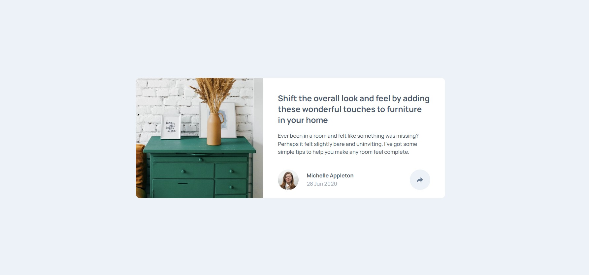

# Article preview component

This is a solution to the [Article preview component challenge on Frontend Mentor](https://www.frontendmentor.io/challenges/article-preview-component-dYBN_pYFT). 

## Table of contents

- [Overview](#overview)
  - [The challenge](#the-challenge)
  - [Screenshot](#screenshot)
  - [Links](#links)
- [My process](#my-process)
  - [Built with](#built-with)
- [Author](#author)

## Overview

### The challenge

Users should be able to:

- View the optimal layout for the component depending on their device's screen size
- See the social media share links when they click the share icon

### Screenshot

### Links

- Solution URL: [GitHub](https://github.com/juhnovais/social-proof-section-main)
- Live Site URL: [Social proof section](https://juhnovais.github.io/social-proof-section-main/)

## My process

### Built with

- Semantic HTML5 markup
- CSS custom properties
- Flexbox
- CSS Grid
- Mobile-first workflow
- JavaScript
- [Sass](https://sass-lang.com/)

## Author

- Website - [Juliana Novais](https://github.com/juhnovais)
- Frontend Mentor - [@juhnovais](https://www.frontendmentor.io/profile/juhnovais)

